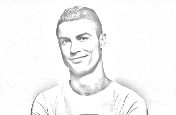

SKETCH PENCIL WITH OPENCV AND PYTHON

----
Hallo semuanya, pada kesempatan ini saya ingin berbagi tentang cara "membuat efek goresan pensil" atau lebih dikenal sketch pencil.

Berbicara metode design yang satu ini tentunya teman-teman yang sudah terbiasa dengan design sangat tidak asing lagi bukan? Namun berbeda dengan cara dan tools yang biasa teman-teman gunakan dalam membuatnya, dalam kesempatan ini saya membuat efek goresan pensil pada suatu gambar menggunakan openCV.

Gambar yang saya gunakan adalah gambar CR7 yang saya ambil secara acak di Google, yaitu :  
  

setelah diterapkan menggunakan OpenCV hasilnya adalah sebagai berikut:  

----
Untuk yang mau mencoba eksplorasi lebih lanjut, silahkan forks saja ya. Thanks :)